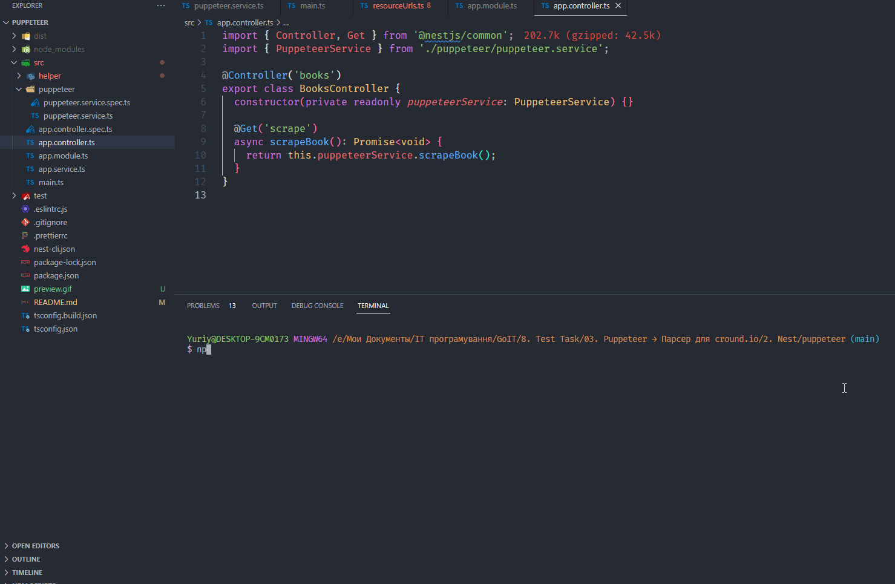

## Puppeteer module

Модуль дозволяє отримати текст сторінки з вказаного URL за первим селектором.
Додатково Puppeteer виконує пошук пагінації, і, якщо вона є, то отримує текст з усіх сторінок.
Далі поєднує текст кожної сторінки, чистить та зберігає в окремий файл.



## Installation

```bash
$ npm install
```

## Running the app

```bash
# development
$ npm run start

# watch mode
$ npm run start:dev

# production mode
$ npm run start:prod
```

## Test

```bash
# unit tests
$ npm run test

# e2e tests
$ npm run test:e2e

# test coverage
$ npm run test:cov
```
